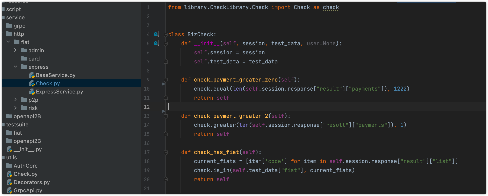
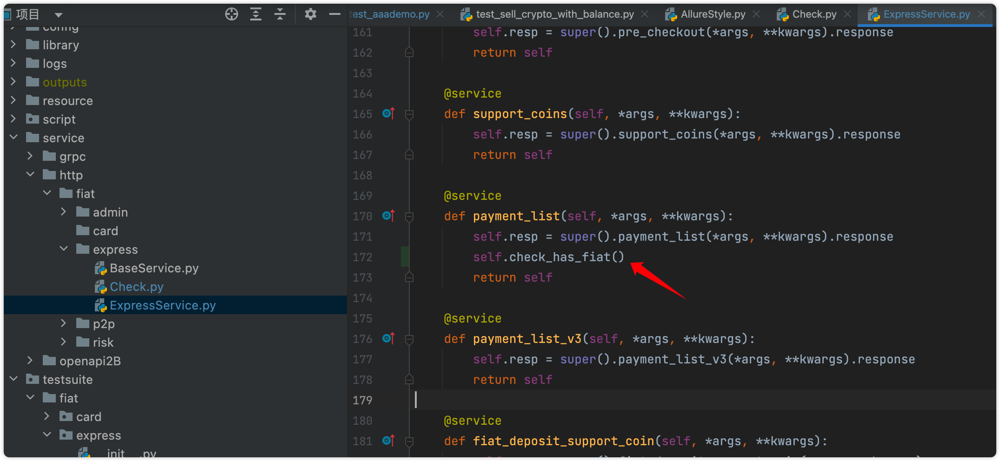
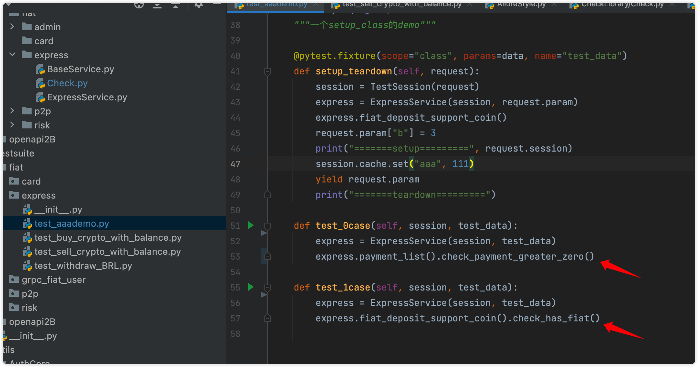
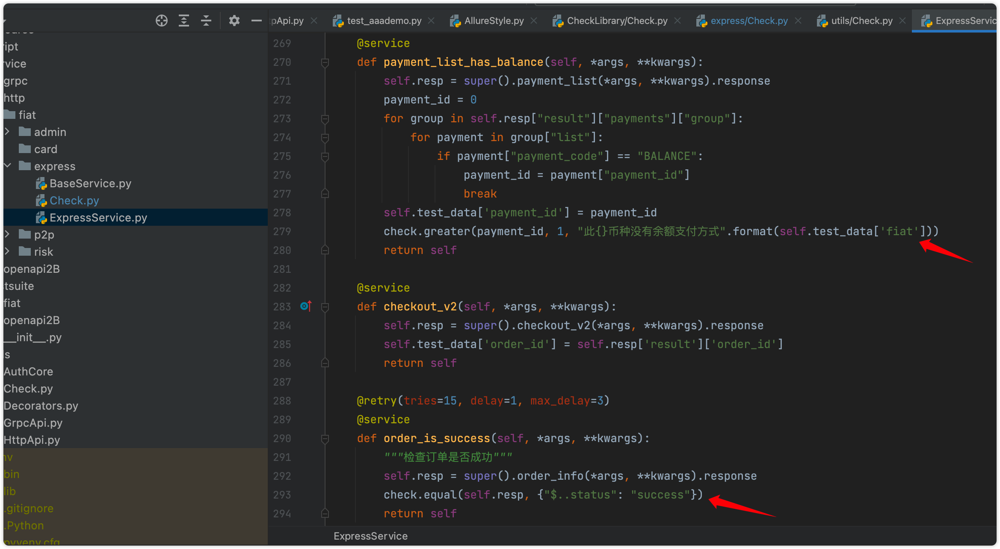
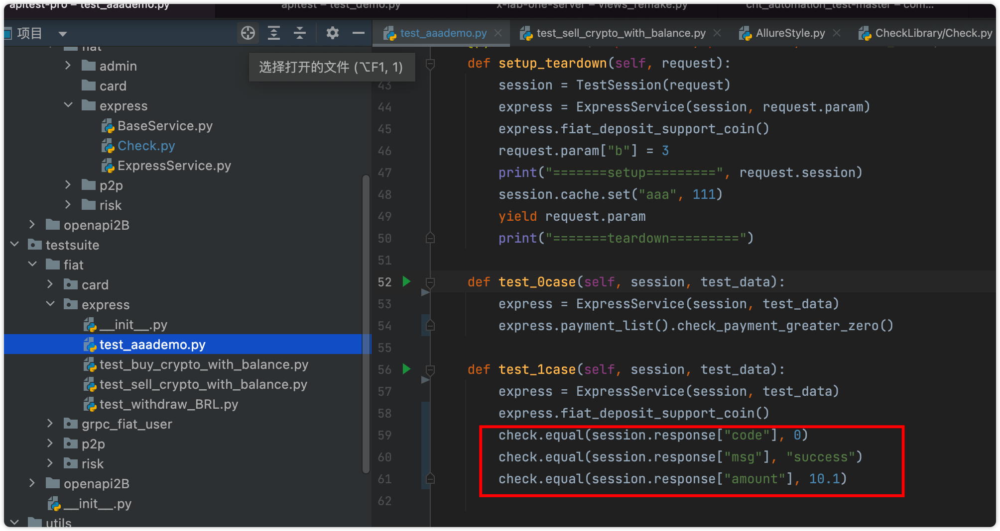
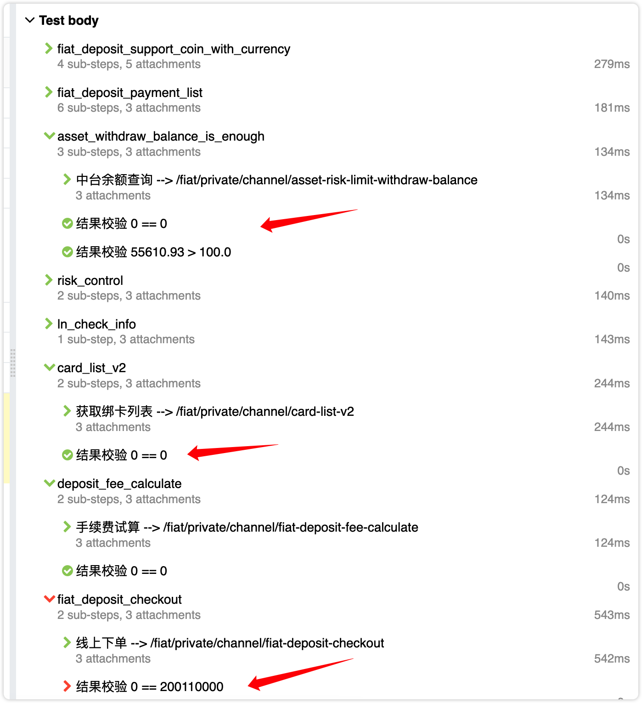

# 断言的设计

## 一、支持的断言方法

* equal
* not_equal
* is_
* is_not
* is_in
* is_not_in
* is_instance
* is_not_instance
* greater
* greater_equal
* less
* less_equal
* match
* key_is_exsit
* key_is_not_exsit

## 二、check支持的2种方式

### 1、左右式断言

```Python
# 代表1==1
check.equal(1,1) 

# 代表从response中获取payments的值，应该大于1
check.greater(len(self.session.response["result"]["payments"]), 1) 

# 代表从response的code的值，应该等于 参数化的test_data中写的预期code
check.equal(self.session.response["code"], self.expect["exp_code"]) 
```

### 2、JsonPath式断言

```Python
# 代表response中的ret_code，然后应该等于0
check.equal(self.session.response, {'ret_code': 0})

# 代表从response中分别提取retCode，retMsg，id，并等于相应的值
check.equal(self.session.response, {"$..retCode": 4004, "$..retMsg": "route not found","$..id": "11"})
```

## 三、[推荐] 在独立的断言层写断言，然后在Service或Case层调用

### 1）Check.py中，进行断言的编写

把断言集中抽离出来，一方面代码会感觉整洁，再一方面一些相同的断言可以抽象出来。

​​

格式如上，记得每个断言方法`return self`​哦。

### 2）断言方法写好之后，可以在Service层使用。如下

​​

### 3）也可以在Case层使用。

​​

## 四、[不推荐]直接在BizService层写断言（不推荐）

​​

## 五、[很不推荐]直接在TestCase层写断言（不推荐）

​​

## 六、请勿使用的写法

请勿使用assert来直接写断言，因为这样写，不会在日志和报告中显示，并且丢失了很多框架特性

```Python
assert session.response["code"] == 0
assert session.response["msg"] == "success"
assert session.response["amount"] > 10.1
```

## 七、断言中可以取到的变量

* ​`self.session.request`​ 取到请求参数
* ​`self.session.response`​ 取到响应内容
* ​`self.test_data`​ 渠道参数化的值
* ​`self.test_data, self.info, self.expect, self.user`​

## 八、在报告中的展示

​​

## 九、断言失败，不影响后续代码执行

> 默认情况下，多个断言中，某一个断言失败，就认为整个case失败了。也不会继续运行下去了。

> 但也有一些业务场景，需要某个断言失败，想继续跑下面的断言or代码，于是有了以下设计。

* 默认在pytest.ini 做了 `--check-max-fail=1`​ 的配置，断言失败，不继续运行。
* 如果想断言失败继续执行，可以在命令行运行时候加上 `--check-max-fail=0`​
